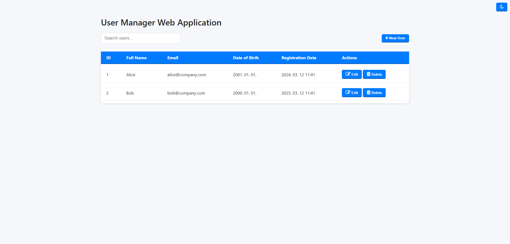
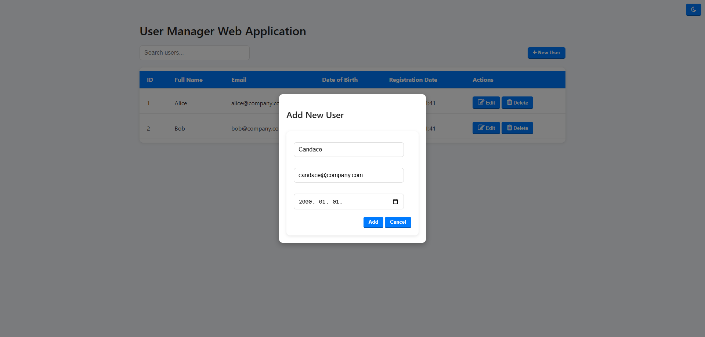
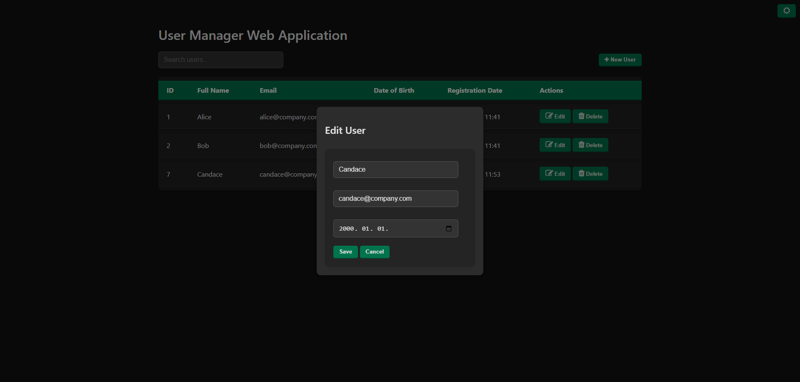
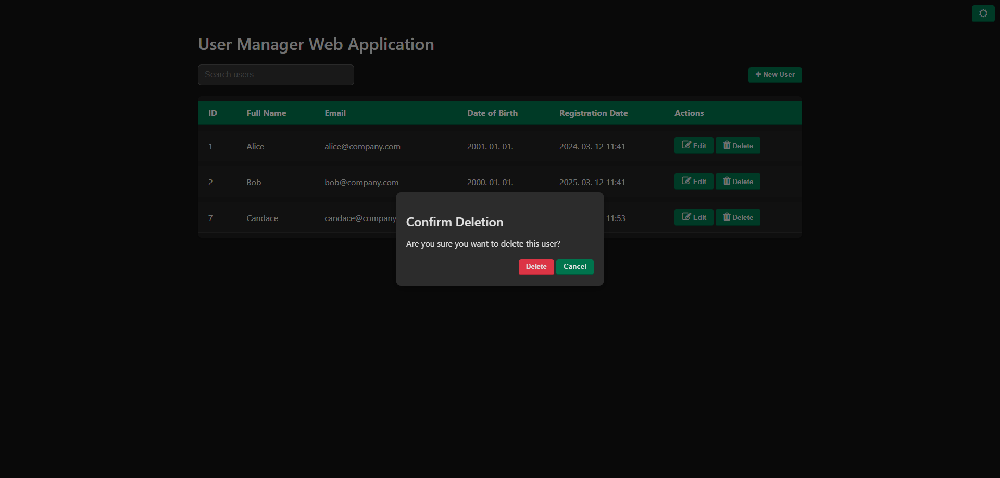

# Simple User Management Web Application

A full-stack CRUD application for managing users. Built with **ASP.NET Core Web API** (backend) and **HTML/CSS/JavaScript** (frontend).

## Screenshots

### User List



### Add User Form



### Edit User (Dark Mode)



### Delete User (Dark Mode)



## Features

- List all users in a dynamic table
- Add new users
- Edit existing user details
- Delete users with confirmation
- Sortable table columns
- Search users by name
- Responsive and modern UI
- Client-side validation
- Live updates after CRUD operations
- Close pop-up windows by pressing 'ESC' or click outside the window area

## Technologies Used

### Backend
- ASP.NET Core Web API
- Entity Framework Core (Code-First)
- SQL Server
- Swagger (Swashbuckle)

### Frontend
- HTML, CSS, JavaScript (Vanilla)
- Fetch API for HTTP requests

## Setup Instructions

### Prerequisites
- .NET SDK 9.0 (https://dotnet.microsoft.com/)
- Visual Studio, VS Code (https://code.visualstudio.com/)
- SQL Server (https://www.microsoft.com/en-us/sql-server)

### Backend Setup

1.	Open 'FSD_ViktorMate_SFQ6PO.sln' in Visual Studio  
	or navigate to project root in PowerShell
	
2.	Install required NuGet packages in Package Manager Console or PowerShell:
```
		dotnet add package Microsoft.EntityFrameworkCore
		dotnet add package Microsoft.EntityFrameworkCore.SqlServer
		dotnet add package Microsoft.EntityFrameworkCore.Tools
		dotnet add package Swashbuckle.AspNetCore
```
4.	Run the project:  
		Ctrl + F5 (Visual Studio)  
		dotnet run (PowerShell)
	
API should be available at: https://localhost:7011/api/users  
Swagger: https://localhost:7011/swagger

### Frontend Setup
Open wwwroot/index.html in your browser using Live Server or any static server (e. g. VS Code Live Server).

Make sure CORS is configured correctly in Program.cs, the port number should match your live server:
```
	app.UseCors(x => x
    .AllowCredentials()
    .AllowAnyMethod()
    .AllowAnyHeader()
    .WithOrigins("http://localhost:5500",
                 "http://127.0.0.1:5500"));
```	
# Notes
IDs are auto-incremented.

registrationDate is set automatically at the time of creation and cannot be edited.

Uses code-first approach; Database.EnsureCreated() ensures DB is generated.

## Known issues or suggested improvements
Show sort direction arrows in table headers so users see the current sorting state visually.

Add a confirmation message or undo option after editing a user, preventing accidental updates.

When fetching or submitting data, show a spinner or loading state on buttons so users know something is happening.

Add pagination or infinite scrolling if the user list becomes large to avoid long loading times.
